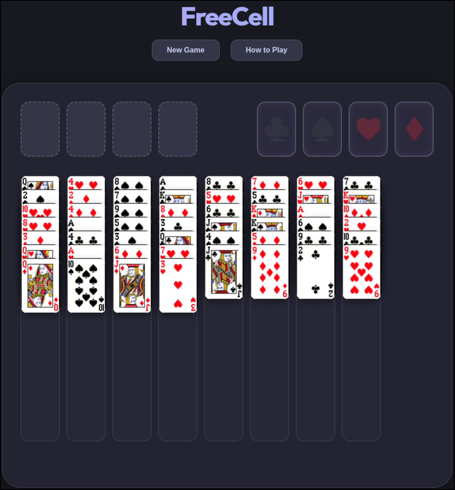

# FreeCell Premium - Catppuccin Edition

A modern, high-performance, and visually stunning remake of the classic solitaire game. This project is a complete overhaul of the original FreeCell implementation by **Gary Kerr (2012)**, bringing it into the modern web era with advanced gameplay mechanics and premium aesthetics.

## ✨ Features

- **Multi-Card Dragging:** Move stacks of cards based on available free cells and empty columns (Advanced calculation logic: `(1 + F) * 2^E`).
- **Auto-Collect Logic:** Intelligent algorithm that automatically moves "safe" cards to foundations to speed up gameplay.
- **Catppuccin Mocha Theme:** A beautiful, dark, and cozy color palette designed for long sessions.
- **Glassmorphism Design:** Modern UI with blurred backgrounds, smooth gradients, and glowing effects.
- **Premium UX:**
  - Micro-animations for card movement.
  - Hover highlights for valid drop targets.
  - Double-click to auto-move cards to foundation/free cells.
  - Responsive hit detection for all columns and slots.

## ⌨️ How to Play

- **Drag & Drop:** Move single cards or valid sequences between columns.
- **Double Click:** Quickly send a card to a free cell or foundation pile.
- **Auto-Collect:** Sit back and watch as the game automatically collects cards that are no longer needed for building.

## 🛠️ Technology Stack

- **Core:** HTML5, Vanilla JavaScript.
- **Styling:** CSS3 (Custom Properties, Glassmorphism).
- **Library:** jQuery & jQuery UI (Modified for advanced drag-drop interactions).
- **Fonts:** [Outfit](https://fonts.google.com/specimen/Outfit) via Google Fonts.

## 📜 Credits & Licensing

- **Original Implementation:** Special thanks to [Gary Kerr](https://github.com/garykerr) for the 2012 original base.
- **Modifications & Remake:** Updated in 2026 with new game logic, auto-move features, and a complete UI redesign.
- **License:** This project is licensed under the **BSD 2-Clause License**, preserving the original copyright of Gary Kerr while allowing for these extensive modifications.

---
*Built with ❤️ for a better Solitaire experience.*
